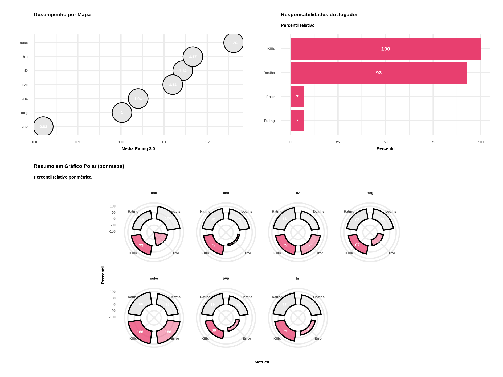
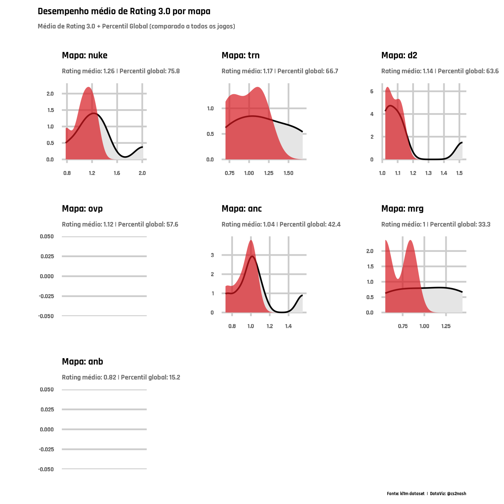
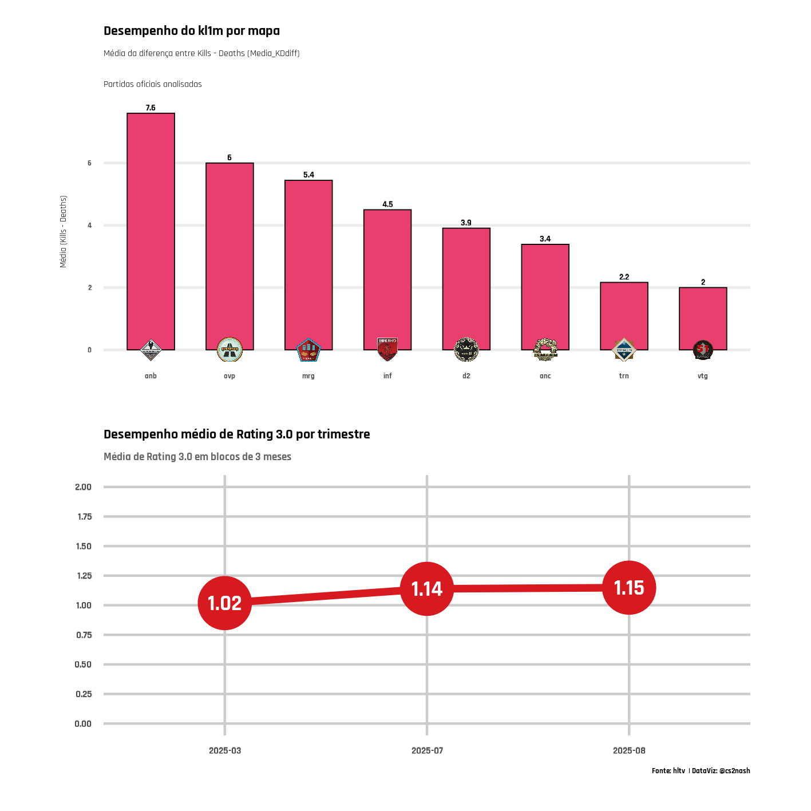
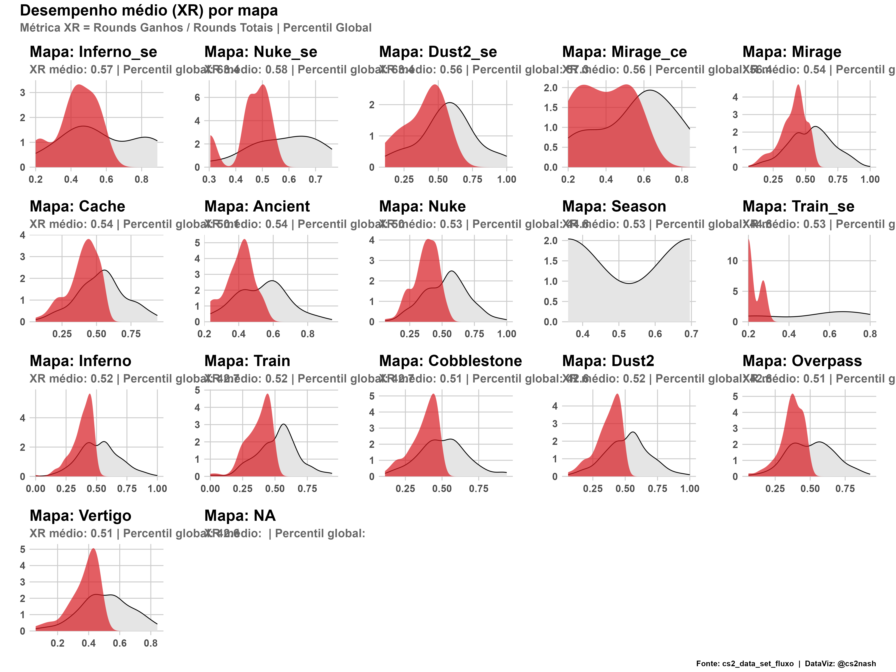

# 🎯 Scouted — DataViz em Counter-Strike 2

Este repositório contém **análises e visualizações** de desempenho em Counter-Strike 2 (CS2).  
Aqui eu exploro estatísticas de jogadores, mapas e times usando **R** para criar dashboards e gráficos.

---

## 📊 Gráficos disponíveis

### ⭐ Top 10 Ratings CS2

### 🟦 Painel Final — SCOUTED TOORO

### 📊 Dashboard SCOUTED TOORO

### 🟨 Painel SCOUTED TOORO

### 🌍 Mapas — SCOUTED TOORO

### 🐭 Dashboard MOUZ

---

## 📂 Datasets incluídos
- `souted - hitori.csv` → estatísticas do jogador Hitori  
- `SCOUTED - TOORO.csv` → dataset de Tooro  
- `mouz - temporada.csv` → dataset do time MOUZ  
- `datset - hltv.csv` → estatísticas coletadas do HLTV  

---

## ⚡ Tecnologias usadas
- **R** (linguagem principal)
- **ggplot2** (visualizações)
- **dplyr / tidyverse** (manipulação de dados)

---

✍️ Desenvolvido por [@devtipsternash](https://github.com/devtipsternash)

